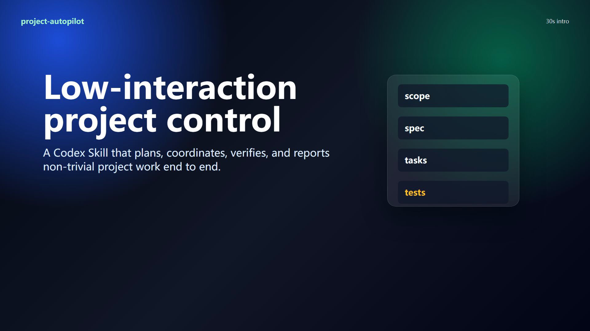

# project-autopilot

## Turn complex Codex work into coordinated, verified delivery.

**project-autopilot gives non-trivial projects a project lead—not more ceremony.** It sizes the work, keeps decisions and tasks synchronized, coordinates only the skills and agents that are useful, pauses at real permission boundaries, and finishes with acceptance evidence.

**让复杂的 Codex 项目从“能做”变成“有组织地做完”。** project-autopilot 会自动判断任务规模、维护事实来源、按需协调 Skill 与 Agent、守住权限边界，并用可复核的验收证据收尾。

[](media/project-autopilot-intro.mp4)

_Click the cover to watch the 30-second introduction · 点击封面观看 30 秒介绍_

## Why it exists

Capable agents can still lose a project in the space between a vague request and a verified result: scope drifts, two workers claim the same task, context disappears after a long thread, an external dependency is enabled without a clear boundary, or implementation is declared complete before acceptance.

project-autopilot provides one lightweight control layer for that gap:

- one lead thread owns scope, sequencing, staffing, and final status;
- OpenSpec—or a repository-local fallback—keeps decisions, tasks, and evidence durable;
- bounded workers receive explicit ownership instead of overlapping mandates;
- external skills, apps, MCPs, account-backed tools, paid services, public publishing, and production actions stop at permission gates;
- validation, privacy checks, repair, and acceptance happen before completion is reported.

强大的 Agent 仍然可能在“模糊需求”到“可靠交付”之间失去控制：范围逐渐漂移、多个执行者重复领任务、长线程压缩后丢失上下文、外部能力在边界不清时被启用，或者只完成实现就宣布结束。

project-autopilot 用一个轻量的项目控制层解决这些问题：由主线程负责范围与顺序，用持久状态保存决策与证据，限制并行执行边界，在外部权限处及时停下，并在最终验收通过后才报告完成。

## How it works

| Task size | Execution model | Project state | Verification |
| --- | --- | --- | --- |
| **Small** | Main thread only | No formal project state unless requested | One focused check |
| **Medium** | Project lead + at most two bounded workers | Light brief and task list | Focused checks + lead review |
| **Large** | Skills and departments selected only where useful | OpenSpec or `.project-autopilot/changes/<change-id>/` | QA, independent review, privacy, and acceptance gates |
| **Enterprise** | Temporary specialists with explicit inputs, outputs, and file ownership | Durable cross-stage handoff | Boundary-by-boundary evidence |

The lead routes work through isolated skills for intake, staffing, domain selection, expert selection, context continuity, methodology, GPT consultation, MCP/app governance, acceptance, and skillbox governance. Not every project loads every skill.

项目组长会在需求澄清、人员配置、领域识别、专家选择、上下文延续、工程方法、GPT 咨询、MCP/App 治理、验收和 Skillbox 治理之间按需路由。不是每个项目都要完整跑一遍全部流程。

## What is included

- `skills/` — the isolated skillbox, with `project-autopilot` as the lead entrypoint.
- `custom-agents/` — bounded department agent configurations.
- `references/registries/` — tracked sources for approved Skill and MCP discovery.
- `external/skills/` — approved, vendored Nuwa and Darwin snapshots.
- `tools/install.py` — user-level installer with backups for replaced files.
- `tools/validate_package.py` — package structure and contract validation.
- `tools/dependency_audit.py` — read-only installed dependency audit.
- `tools/mcp_discovery.py` — read-only MCP source discovery.
- `tools/privacy_scan.py` — repeatable privacy and hardcoded-path scan.
- `skill/` — legacy compatibility package and validation scripts.
- `video/` and `media/` — source and rendered 30-second introduction.

## Install

Requirements: Python 3 and Codex.

```bash
git clone https://github.com/diiiiiiylan/project-autopilot.git
cd project-autopilot
python tools/install.py
```

The installer copies the skillbox to `$HOME/.agents/skills/`, agent definitions to `${CODEX_HOME:-$HOME/.codex}/agents/`, and a managed project-autopilot rule block to `${CODEX_HOME:-$HOME/.codex}/AGENTS.md`. Existing changed files are backed up under `${CODEX_HOME:-$HOME/.codex}/backups/project-autopilot/` before replacement.

安装器会把 Skillbox、Agent 定义和全局规则写入对应的用户目录；覆盖已有差异文件前，会先在 Codex 备份目录中保留副本。

Use it explicitly when needed:

```text
Use $project-autopilot for this project.
```

The installed global rule can also route non-simple project work into the skillbox automatically.

## Permission boundaries

project-autopilot may inspect locally installed capabilities, but it does not silently cross external boundaries. The workflow pauses before:

- downloading or installing an external Skill or application;
- enabling or creating an MCP integration;
- using browser automation with a logged-in account;
- calling paid services or account-backed tools;
- publishing publicly or operating on production systems.

It reports what capability is needed, what is lost if it is skipped, where it would be installed, and the rollback boundary. The user remains the authority.

project-autopilot 可以检查本地已有能力，但不会静默跨越外部边界。下载或安装外部 Skill/App、启用或创建 MCP、使用登录态浏览器、调用付费或账号能力、公开发布或操作生产环境之前，都会立即停下并请求明确授权。

## Validate

Run the repository's full validation set before publishing changes:

```bash
python tools/validate_package.py .
python -m unittest discover -s tests -v
python skill/scripts/validate_skill.py skill --agent-dir custom-agents
python -m unittest discover -s skill/tests -v
python tools/privacy_scan.py .
```

When the Remotion source changes, render the video as well:

```bash
cd video
npm install
npm run render
```

## Safety and release hygiene

This public repository is built from a sanitized release copy. Generated caches, dependency folders, local environment files, logs, secrets, and user-home paths are excluded. Public changes should pass `tools/privacy_scan.py` before push.

Nuwa and Darwin snapshots are included only as previously approved vendored sources. Future external downloads and integrations remain permission-gated.

## Feedback

If project-autopilot matches a workflow you are trying to stabilize, open an [Issue](https://github.com/diiiiiiylan/project-autopilot/issues) with the task shape, where coordination failed, and what evidence you expected at the end.

如果你正在处理一个容易失控的 Codex 项目，欢迎在 [Issues](https://github.com/diiiiiiylan/project-autopilot/issues) 中描述任务规模、失控位置和期望的验收证据。
